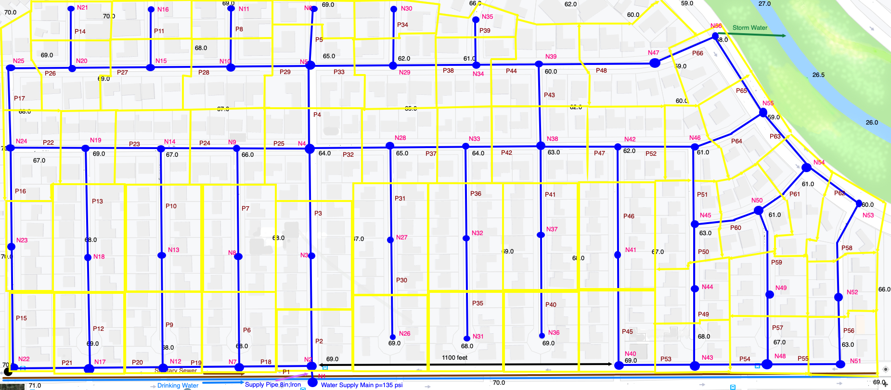

# ES-3

## Purpose:
Demonstrate ability to estimate demand for a subdivision-scale water distribution skeleton model.

## Background
Figure 1 is a layout of a hydraulic network model for the Somewhere USA subdivision. The blue line segments are pipes and are labeled (P1, P2,...).  The blue circles are nodes and are labeled (N1, N2,...).  The yellow polygons represent the lots assigned to each node; for example, node N2 supplies the six (6) lots located near the node.

Figure 1 is a subdivision conceptual map for Somewhere, USA. The numbers on the map are land surface elevations located at the decimal points in the drawing. Along the bottom edge of the map is a black line segment (with arrowheads at each end) that indicates a distance of 1,100 feet on the map. The black circle in the lower left hand corner is to be used as an origin for X-Y measurements for making XYZ data files.

|Figure 1.  Water Distribution System Hydraulic Model for Somewhere USA|
|---|

The semester design project is the conceptual design and analysis of a water distribution, stormwater collection, and wastewater collection system for this subdivision. The water distribution system uses the skeleton layout above. The .png file is [located here](https://3.137.111.182/ce-3372-webbook/exercise3/SomewhereUSANetworkMap.png) so you can render a larger graphic if needed.

## Exercise
Estimate demand at nodes for the skeleton model by:

1. Determine the number of lots served by each node, these will constitute the by-node service unit equivalent (SUE).
2. Estimate the average daily demand (ADD), by-node, for distribution system usingSan Marcos, Texas water system design guidelines.
3. Estimate the maximum daily demand (MDD), by-node, for the distribution systemusing San Marcos, Texas water system design guidelines.
4. Estimate the maximum daily demand (MDD) + fire flow, by-node for the distribu-tion system using San Marcos, Texas water system design guidelines.
5. Estimate  the  peak  hourly  demand  (PHD),  by-node,  for  the  distribution  systemusing San Marcos, Texas water system design guidelines.

## Deliverables:

Use your estimates to produce a 1-page report on the artitmetic employed to estimate demand, and a complete version of Table 1 below.  Save the table (in a file) – you will need it later in the design project RP-1, and include the table in your report.

||Table 1:  Node Demands for Somewhere USA Distribution System||
|:---|---|---:|

|Node ID|SUE    |ADD     |MDD     |MDD+Fire |PHD    |
|:------|------:|------:|------:|------:|------:|
|N1  |   0|   0|   0|   0|   0|
|N2  |   6|$\dots$|$\dots$|$\dots$|$\dots$|
|N3  |  11|$\dots$|$\dots$|$\dots$|$\dots$|
|$\dots$|$\dots$|$\dots$|$\dots$|$\dots$|$\dots$|
|N54 |$\dots$|$\dots$|$\dots$|$\dots$|$\dots$|
|N55 |$\dots$|$\dots$|$\dots$|$\dots$|$\dots$|
|N56 |$\dots$|$\dots$|$\dots$|$\dots$|$\dots$|

