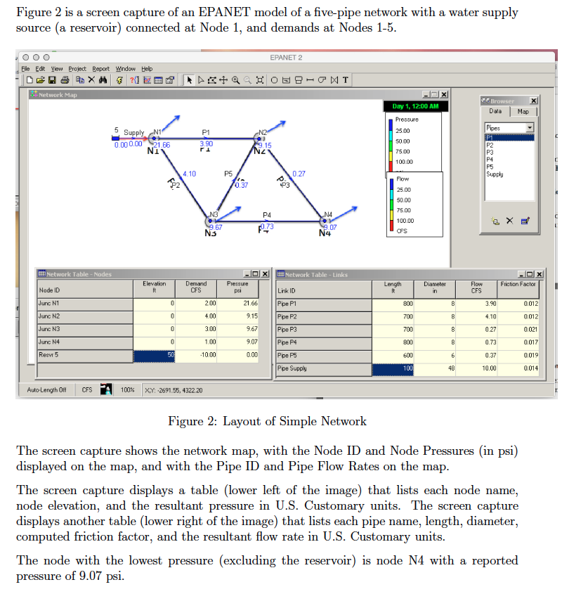
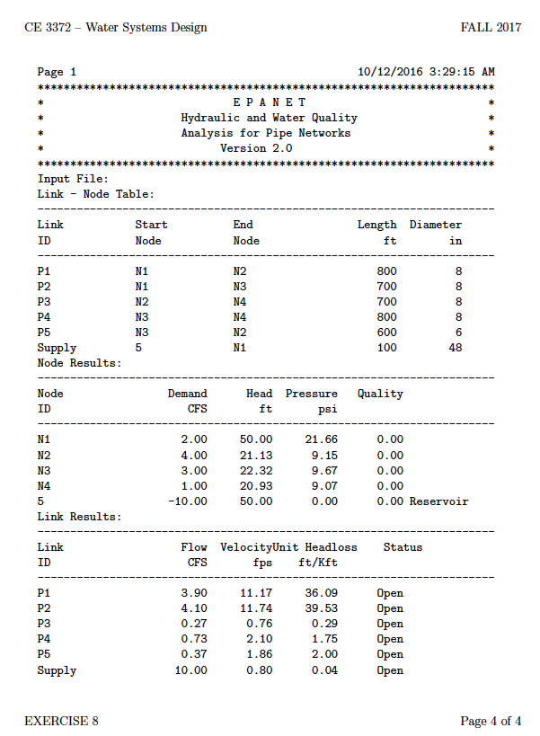

# ES-7 EZ Button Solution Sketch

You still need to write the memo!

## Background

Figure  1  is  a  five-pipe  network  with  a  water  supply  source  (a  reservoir,  not  shown) connected at Node 1, and demands at Nodes 1-5.  
Table 1 is a list of the relevant pipe and node data.


---
## Exercise 1

Build an EPANET model, using the Hazen-Williams head loss model of the network. From your preparation, or the completed model:

a)  Write the node equations of continuity for Nodes 1-4.

$[N1]~~Q_0 - Q_1 - Q_2  =  2$  The value of $Q_0$ is known at 10 cfs.

$[N2]~~Q_1 - Q_3 - Q_5  =  4$

$[N3]~~Q_2 - Q_4 - Q_5  =  3$

$[N4]~~Q_3 + Q_4        =  1$

b)  Write the head loss equations for each of the pipes in the system.

$[P0]~~H_0 - H_1 = 0 $  This is the reservoir in the system, called a fixed grade node.  we know value of $H_0$

$[P1]~~H_1 - 3.02*L_1*D^{-1.667}_1*\frac{4*Q_1}({\pi*D^2_1*C_{h-1}})^{1.85} - H_2  = 0 $

$[P2]~~H_1 - 3.02*L_2*D^{-1.667}_2*\frac{4*Q_2}({\pi*D^2_2*C_{h-2}})^{1.85} - H_3  = 0 $

$[P3]~~H_2 - 3.02*L_3*D^{-1.667}_3*\frac{4*Q_3}({\pi*D^2_3*C_{h-3}})^{1.85} - H_4  = 0 $

$[P4]~~H_3 - 3.02*L_4*D^{-1.667}_4*\frac{4*Q_4}({\pi*D^2_4*C_{h-4}})^{1.85} - H_4  = 0 $

$[P4]~~H_3 - 3.02*L_5*D^{-1.667}_5*\frac{4*Q_5}({\pi*D^2_5*C_{h-5}})^{1.85} - H_2  = 0 $


c)  Make a screen capture of the EPANET program showing your network map, with the Node ID and Node Pressures displayed on the map, and with the Pipe ID and Pipe Flow Rates on the map.



Link to .inp file used in above figure. 1. <a href="https://3.137.111.182/ce-3372-webbook/exercise7/ES7.net">  </a> 

---
## Exercise 2

a)  Make a table that lists each node name, node elevation, and the resultant pressurein U.S. Customary units.

b)  Make a table that lists each pipe name,  length,  diameter,  Hazen-Williams coefficient, and the resultant flow rate in U.S. Customary units.

c)  Determine the flow rate in each pipe of the network, for the case where the total head at Node 1 is 100 feet.

d)  Determine the Darcy-Weisbach friction factor in each pipe of the network.

Above all appear in the above screen capture.  Now from the EPANET report:



e)  Using the results of your flow distribution, determine the head loss from Node 1 to Node 4.

$ H_1 = 50, H_4 = 20.93, Loss =29.07$. Loss won't change if $H_1$ increased to 100 ft.

f)  Determine the head at Node 4

$ H_4 = 70.93 $

g)  Identify the node with the lowest **pressure** in your solution.

$N_4$ has lowest pressure @ 30.73 when run with correct head at node 1.


```python

```
