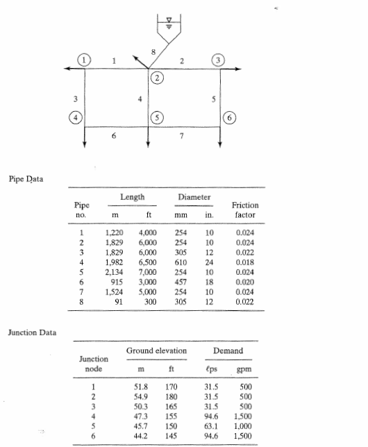
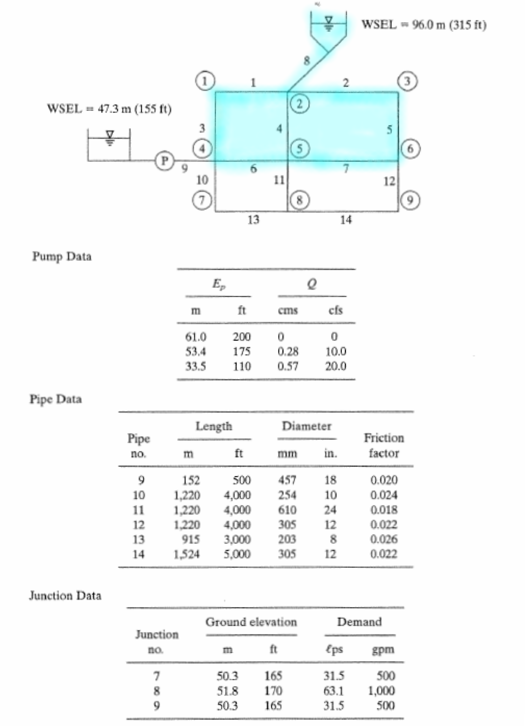

# ES-8

## Purpose:

- Compute flow distribution in pipeline networks. 
- Introduction to use of professional software (EPANET)
- Develop expertise in interpreting output 

## Background

Figure 1 is a water distribution system (skeleton network). The water surface elevation in the
storage tank is 315.0 ft. 

||||
|---|---|---|

||Figure 1. Primary Skeleton Network||
|---|---|---|

---
## Exercise 1

Use EPANET and the **Darcy-Weisbach** head loss model to compute
the discharge in each pipe and the pressure at each junction node for the 8-pipe system
shown in Figure 1. Adjust the roughness coefficient (in the program) until the **computed**
friction factors closely agree with the friction factors (exact agreement is not possible) in the table in Figure 1.

Background file for network [https://3.137.111.182/ce-3372-webbook/exercise8/network1.bmp](https://3.137.111.182/ce-3372-webbook/exercise8/network1.bmp)

From your model:

a) Make a screen capture of the EPANET program showing your network map, with the
Node ID and Node Pressures displayed on the map, and with the Pipe ID and Pipe Flow
Rates on the map.

b) Make a table that lists each node name, node elevation, and the resultant pressure in
U.S. Customary units.

c) Make a table that lists each pipe name, length, diameter, roughness coefficient, computed friction factor, and
the resultant flow rate in U.S. Customary units.

d) Identify the node with the lowest pressure in your solution.

---
## Exercise 2

The pipe network in Figure 1 (shaded part of the diagram in Figure 2) is expanded to a 14-pipe system and
includes a ground-level reservoir near junction node 4 as depicted in Figure 2. 

||||
|---|---|---|

||Figure 2. Expanded Skeleton Network||
|---|---|---|

The demands at each node in the original system are unchanged.

A pump is installed in the 18-inch diameter pipe extending 500 feet from the ground-level
reservoir (WSE = 155 ft.) to junction node 4. The booster pump pushes water into the
network; three points on the pump curve are listed on the figure.
Use EPANET and the **Darcy-Weisbach** head loss model to compute the discharge in each
pipe and the pressure at each junction node for the 14-pipe system shown in Figure 2. Adjust
the roughness coefficient (in the program) until the computed friction factors closely agree
with the friction factors in the table in Figures 1 and 2, do not expect to obtain an exact match,
within 20 percent is sufficient.

Background file for network [https://3.137.111.182/ce-3372-webbook/exercise8/network2.bmp](https://3.137.111.182/ce-3372-webbook/exercise8/network2.bmp)

a) Make an table that shows the conversion of the pump curve flow units from cubic-feet-per-second into gallons-per minute.

b) Make a screen capture of the pump curve input dialog in EPANET and include it (the screen capture) in the technical memorandum below.

c) Make a screen capture of the EPANET program showing your network map, with the Node ID and Node Pressures displayed on the map, and with the Pipe ID and Pipe Flow Rates on the map. Also set the map features to indicate flow directions on the pipe elements.

d) Make a table that lists each node name, node elevation, and the resultant pressure in
U.S. Customary units.

e) Make a table that lists each pipe name, length, diameter, computed friction factor, and
the resultant flow rate in U.S. Customary units.

f) Identify the node with the lowest pressure in your solution.
Submit the above items as content in a technical memorandum that includes a description
of how the model was built and a discussion and interpretation of the results.

## Deliverables:

Submit the above items as content in a technical memorandum that includes a description
of how the models were built and a discussion and interpretation of the results.

Attach the EPANET output reports (there should be two) to the memorandum.
## References
1. Rossman,  L.  (2000).   EPANET  2  users  manual.   Technical  Report  EPA/600/R-00/057,U.S. Environmental Protection Agency, National Risk Management Research LaboratoryCincinnati, OH 45268.
