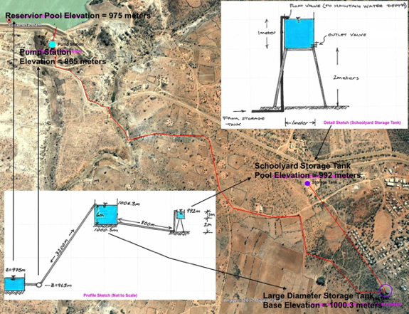

## CE 3372 Water Systems Design
### Lesson 6. Pipeline Hydraulics

#### Example: Steady Discharge between Reservoirs (using on-line tools)


```python

```

### Linking Systems 

A hydraulic system can be analysed as a set of linked components to make an otherwise complicated system easier to analyze.

- Idea is to decompose into smaller (hydraulically) independent parts, analyze the parts then reassemble (integrate) the parts to answer questions about the whole system

#### Example: Rural Water Supply to a Village School



The figure is an aerial image of a pipeline system with preliminary engineering sketches of the system (lower left panel) and a detail sketch of the terminal small storage tank (upper right panel). The 3,200 meter long pipeline lifts 25C water ( $\rho= 997 kg/m^3$,$\nu= 8.94 E-7 m^2/s$) from a treatment plant on the downstream face of Gulameta Dam through a 127 millimeter high-density polyethylene (HDPE) pipe (ks =0.0015 mm) to a large diameter at-grade cylindrical storage tank. A secondary, 800 meter long pipeline carries water from the large diameter storage tank to a small, cylindrical (D = 1 meter), elevated storage tank at the village school. Both storage tanks have float valves to prevent overflow and maintain the indicated water pool elevations.

Analyze proposed system to determine anticipated behavior under various situations:

- Float valve fails at school
- Outlet valve accidently left open
- Pump operation under worst failure mode
- Pump fails, time until system fails/drains
- Float valve limited
- Oultet valve limited

**Float Valve at School Fails**


```python

```

**School Outlet Valve Left Open**


```python

```

**Pump System Requirements**


```python

```

**Pump System Fails, Time to Drain**
